:00:00:00.000  

# Regularizing your neural network  

  

Why regularization reduces overfitting  

:00:00:03.000  

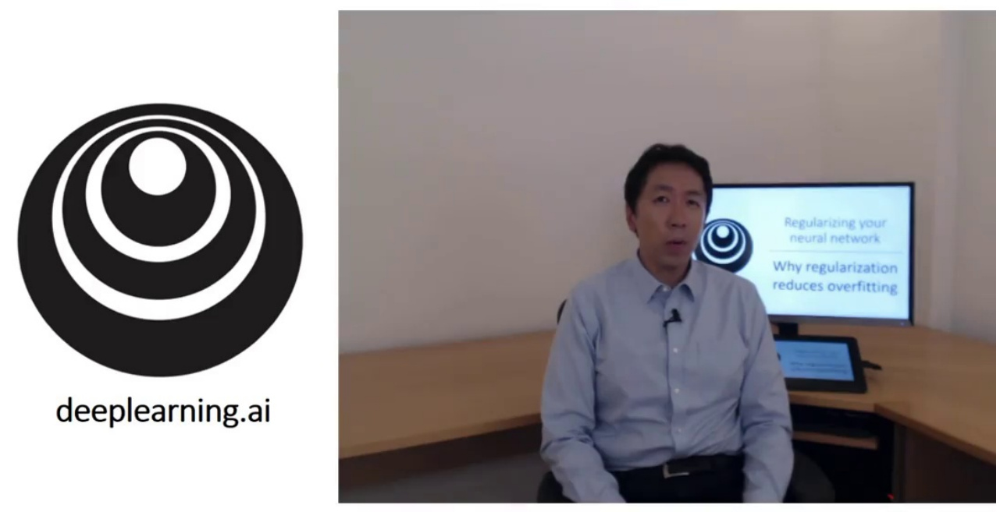  

:00:00:06.000  

# Regularizing your neural network  

  

Why regularization reduces overfitting  

:00:00:10.000  

How does regularization prevent overfitting?  

  

  
high bias  

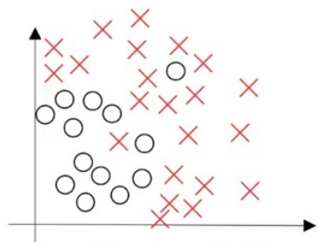  
"just right"  

  
high variance  

Andrew Ng  

:00:00:20.000  

How does regularization prevent overfitting?  

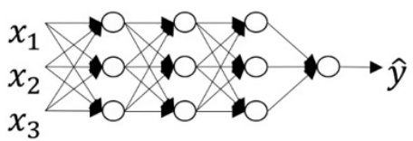  

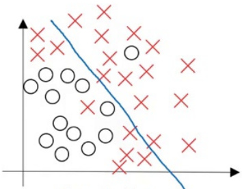  
high bias  

  
"just right"  

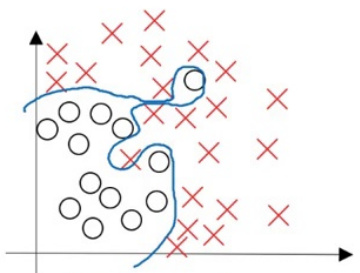  
high variance  

Andrew Ng  

:00:00:40.000  

# How does regularization prevent overfitting?  

  

(w",  

  
high bias  

  
“just right"  

  
high variance  

Andrew Ng  

:00:01:00.000  

# How does regularization prevent overfitting?  

  

$$
3(40^{(\omega)},b^{\omega})=\frac{1}{m}\sum\limits_{i=1}^{m}(\cos^{i},y^{\omega})+\frac{\lambda}{2m}\sum\limits_{k=1}^{2}114^{\tan^{(\omega)}}
$$  

  
high bias  

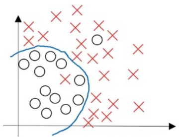  
“just right"  

  
high variance  

Andrew Ng  

:00:01:20.000  

# How does regularization prevent overfitting?  

  

  

  
high bias  

  
"just right"  

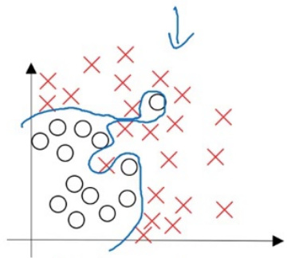  
high variance  

Andrew Ng  

:00:01:40.000  

# How does regularization prevent overfitting?  

  

  

  
high bias  

  
"just right"  

  
high variance  

Andrew Ng  

:00:02:00.000  

# How does regularization prevent overfitting?  

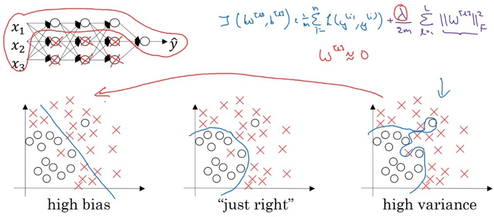  

Andrew Ng  

:00:02:20.000  

# How does regularization prevent overfitting?  

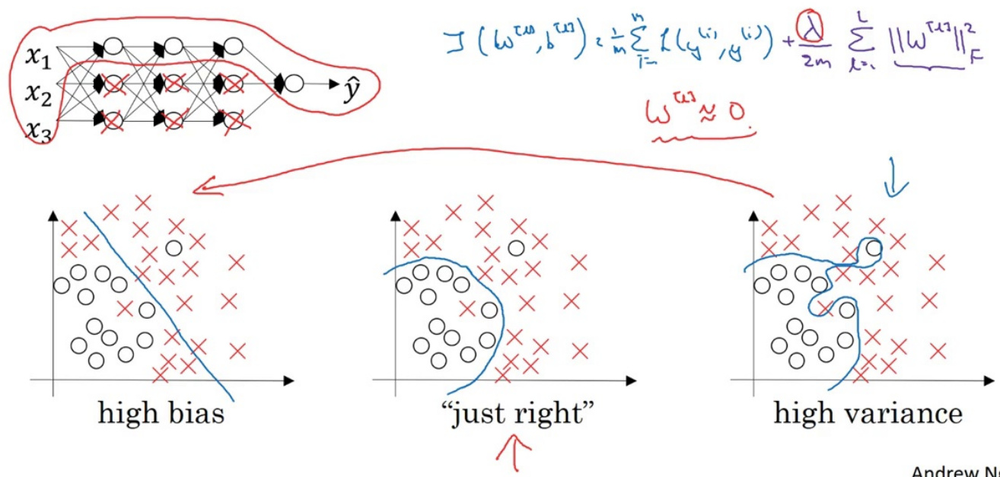  

Andrew Ng  

:00:02:40.000  

# How does regularization prevent overfitting?  

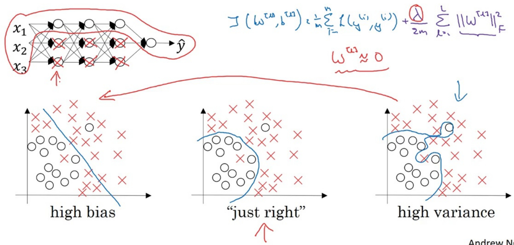  

Andrew Ng  

:00:03:00.000  

How does regularization prevent overfitting?  

  

:00:03:20.000  

How does regularization prevent overfitting?  

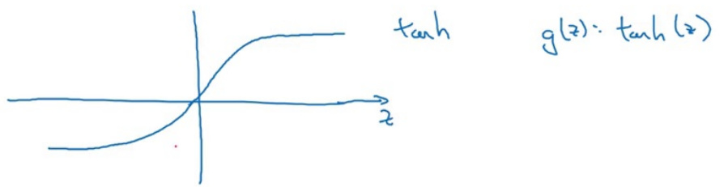  

:00:03:40.000  

How does regularization prevent overfitting?  

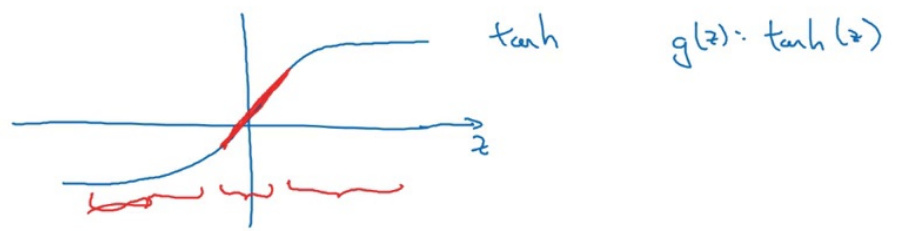  

:00:04:00.000  

How does regularization prevent overfitting?  

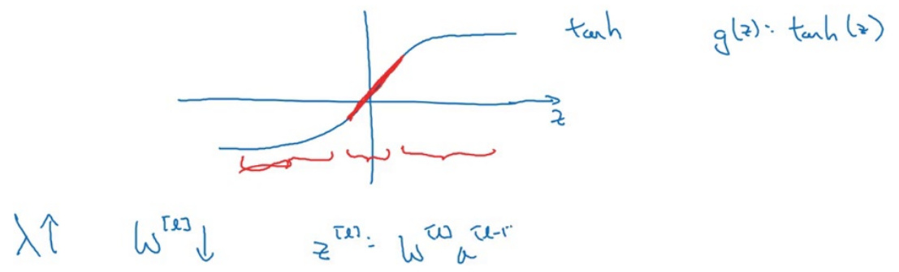  

:00:04:20.000  

How does regularization prevent overfitting?  

  

:00:04:40.000  

How does regularization prevent overfitting?  

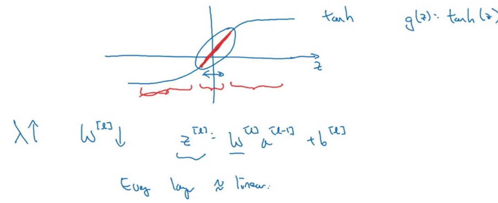  

:00:05:00.000  

How does regularization prevent overfitting?  

  

:00:05:20.000  

How does regularization prevent overfitting?  

  

:00:05:40.000  

How does regularization prevent overfitting?  

  

:00:06:00.000  

How does regularization prevent overfitting?  

  

:00:06:20.000  

# How does regularization prevent overfitting?  

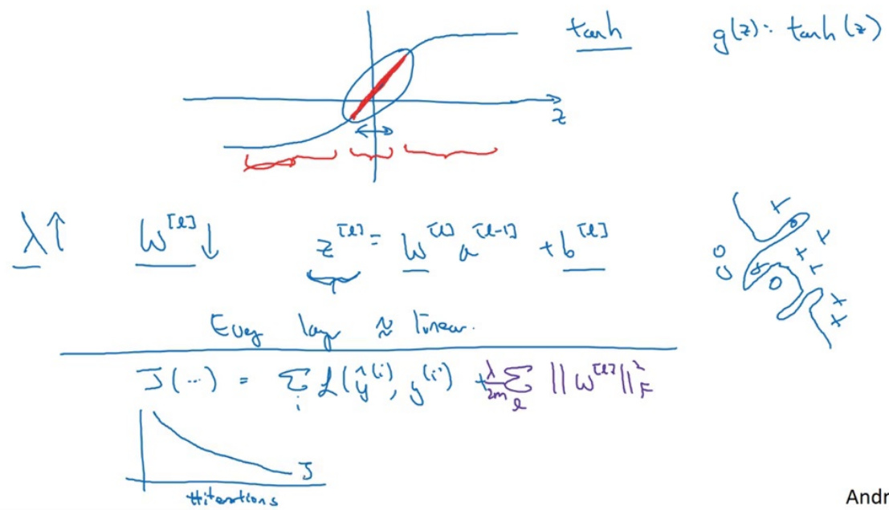  

:00:06:40.000  

# How does regularization prevent overfitting?  

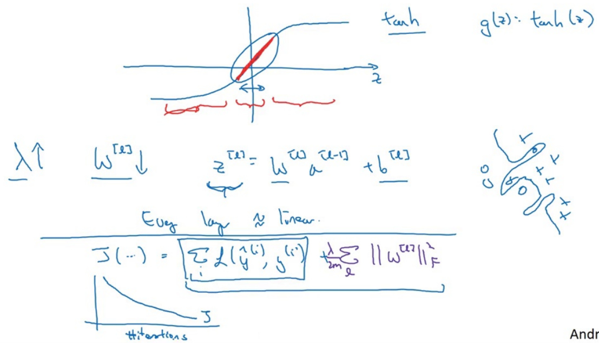  

:00:06:54.000  

  

  

Andrew Ng  

:00:07:00.000  

  

  

Andrew Ng  