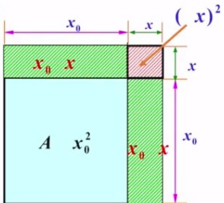

:00:00:00.000  

■:00:00:01.999  

# 人工智能原理与实践  

主讲人： 吴贺俊副教授  

■:00:00:09.999  

# 人工智能原理与实践机器学习板块  

第1章 数学基础1.2高等数学I  

■:00:00:11.999  

  

■:00:00:20.999  

  

■:00:00:41.999  

  

:00:00:42.999  

■:00:01:02.999  

# 导数  

法国数学家费马(Fermat)为研究极值问题引入了导数的概念  

已知运动规律求速度(英国-牛顿Newton)  

已知曲线求其切线(德国-莱布尼茨Leibniz)  

在已知运动规规律求速度的问题上  

:00:01:23.999  

  

■:00:01:44.999  

# 求速度  

假设一个动点，在时刻的位置函数是 $s=f(t)$ ，求该动点在 $t_{0}$ 时刻的瞬时速度。  

解：动点在 ${{t}_{0}}$ 时刻的位置是 $s_{0}=f(t_{0})$ ，经过运动时间At后，时刻设为t，动点的新位置： $s=f(t)$  

  

:00:02:05.999  

# 求速度  

假设一个动点，在时刻的位置函数是 $s=f(t)$ ，求该动点在 $t_{0}$ 时刻的瞬时速度。  

解：动点在 ${{t}_{0}}$ 时刻的位置是 $s_{0}=f(t_{0})$ ，经过运动时间At后，时刻设为t，动点的新位置： $s=f(t)$  

则：平均速度 ${\bar{v}}={\frac{\Delta s}{\Delta t}}={\frac{s-s_{0}}{t-t_{0}}}={\frac{f(t)-f(t_{0})}{t-t_{0}}}$  

  

:00:02:26.999  

# 求速度  

假设一个动点，在时刻的位置函数是 $s=f(t)$ ，求该动点在 $t_{0}$ 时刻的瞬时速度。  

解：动点在 ${{t}_{0}}$ 时刻的位置是 $s_{0}=f(t_{0})$ ，经过运动时间At后，时刻设为t，动点的新位置： $s=f(t)$ 则：平均速度 ${\bar{v}}={\frac{\Delta s}{\Delta t}}={\frac{s-s_{0}}{t-t_{0}}}={\frac{f(t)-f(t_{0})}{t-t_{0}}}$  

  

■:00:02:47.999  

# 求速度  

假设一个动点，在时刻的位置函数是 $s=f(t)$ ，求该动点在 $t_{0}$ 时刻的瞬时速度。  

解：动点在 $t_{0}$ 时刻的位置是 $s_{0}=f(t_{0})$ ，经过运动时间At后，时刻设为t，动点的新位置： $s=f(t)$  

则：平均速度 ${\bar{v}}={\frac{\varDelta s}{\varDelta t}}={\frac{s-s_{0}}{t-t_{0}}}={\frac{f(t)-f(t_{0})}{t-t_{0}}}$  

当 $t\to t_{0}$ 时，动点的瞬时速度为：  

$$
v=l i m{\frac{f(t)-f(t_{0})}{t-t_{0}}}
$$  

  

:00:03:08.999  

# 导数的定义  

设函数 $y=f(x)$ 在点 $x_{0}$ 的某个邻域内有定义，当自变量 $x$ 在 $x_{0}$ 取得增量 $\varDelta x$ （点$x_{0}+\varDelta x$ 仍在该邻域内)时，相应地函数y取得增量 $\varDelta y=f(x_{0}+\varDelta x)-f(x_{0})$ ；  

:00:03:29.999  

# 导数的定义  

设函数 $y=f(x)$ 在点 $x_{0}$ 的某个邻域内有定义，当自变量 $x$ 在 $x_{0}$ 取得增量 $\varDelta x$ (点$x_{0}+\varDelta x$ 仍在该邻域内)时，相应地函数y取得增量 $\varDelta y=f(x_{0}+\varDelta x)-f(x_{0})$ ；  

■:00:03:50.999  

# 导数的定义  

设函数 $y=f(x)$ 在点 $x_{0}$ 的某个邻域内有定义，当自变量 $x$ 在 $x_{0}$ 取得增量 $\varDelta x$ （点$x_{0}+\varDelta x$ 仍在该邻域内)时，相应地函数y取得增量 $\varDelta y=f(x_{0}+\varDelta x)-f(x_{0})$ 如果 $l i m\frac{{\varDelta}y}{{\varDelta}x}=\ \operatorname{lim}_{{\varDelta}x\rightarrow0}\frac{f(x_{0}+{\varDelta}x)-f({\acute{x_{0}}})}{{\varDelta}x}$ 存在，则称函数 $y=f(x)$ 在点 $x_{0}$ 处可导，并这个极限为函数 $y=f(x)$ 在点 $x_{0}$ 处的导数：并且这个极限的值为y=f(x)  

■:00:04:11.999  

# 导数的定义  

设函数 $y=f(x)$ 在点 $x_{0}$ 的某个邻域内有定义，当自变量 $x$ 在 $x_{0}$ 取得增量 $\varDelta x$ （点  
$x_{0}+\varDelta x$ 仍在该邻域内)时，相应地函数y取得增量 $\varDelta y=f(x_{0}+\varDelta x)-f(x_{0})$   
如果 $l i m\frac{{\varDelta}y}{{\varDelta}x}=\ \operatorname{lim}_{{\varDelta}x\rightarrow0}\frac{f(x_{0}+{\varDelta}x)-f({\acute{x_{0}}})}{{\varDelta}x}$ 存在，则称函数 $y=f(x)$ \*  
在点 $x_{0}$ 处可导，并这个极限为函数 $y=f(x)$ 在点 $x_{0}$ 处的导数：记为 $y^{\prime}\vert x=x_{0}$ 或 ${\frac{d y}{d x}}|x=x_{0}$ 或f $f^{\prime}(x_{0})$ 或： $f^{\prime}(x_{0})=\operatorname*{lim}_{x\to x_{0}}{\frac{f(x)-f(x_{0})}{x-x_{0}}}$  

:00:04:32.999  

# 导函数  

如果函数 $y=f(x)$ 在开区间/内处处都可导，就称 $f(x)$ 在开区间/内可导。  

我们这个x0如果是在一个开区间I之内  

:00:04:53.999  

# 导函数  

如果函数 $y=f(x)$ 在开区间I内处处都可导，就称 $f(x)$ 在开区间I内可导。  

$\forall x_{0}\in I,$ $f(x)$ 都有一个确定的导数值 $f^{\prime}(x_{0})$ 则 $f^{\prime}(x),x\in I$ 也是一个函数，它叫做原来函数 $f(x)$ 的导函数.记作 $y^{\prime},f^{\prime}(x),{\frac{d y}{d x}}$ 或 $\textstyle{\frac{d f(x)}{d x}}$  

:00:05:14.999  

# 导函数  

如果函数 $y=f(x)$ 在开区间I内处处都可导，就称 $f(x)$ 在开区间I内可导。  

$\forall x_{0}\in I,$ $f(x)$ 都有一个确定的导数值 $f^{\prime}(x_{0})$ 则 $f^{\prime}(x),x\in I$ 也是一个函数，它叫做原来函数 $f(x)$ 的导函数.记作 $y^{\prime},f^{\prime}(x),{\frac{d y}{d x}}$ 或 $\textstyle{\frac{d f(x)}{d x}}$  

:00:05:35.999  

# 导函数  

如果函数 $y=f(x)$ 在开区间/内处处都可导，就称 $f(x)$ 在开区间I内可导。  

$\forall x_{0}\in I,$ $f(x)$ 都有一个确定的导数值 $f^{\prime}(x_{0})$ 则 $f^{\prime}(x),x\in I$ 也是一个函数，它叫做原来函数 $f(x)$ 的导函数.记作 $y^{\prime},f^{\prime}(x),{\frac{d y}{d x}}$ 或 $\textstyle{\frac{d f(x)}{d x}}$  

所以这个函数叫做原来函数的导函数  

:00:05:56.999  

# 导函数  

如果函数 $y=f(x)$ 在开区间I内处处都可导，就称 $f(x)$ 在开区间I内可导。  

$\forall x_{0}\in I,$ $f(x)$ 都有一个确定的导数值 $f^{\prime}(x_{0})$ 则 $f^{\prime}(x),x\in I$ 也是一个函数，它叫做原来函数 $f(x)$ 的导函数.记作 $y^{\prime},f^{\prime}(x),{\frac{d y}{d x}}$ 或 $\textstyle{\frac{d f(x)}{d x}}$  

如果 $\boldsymbol{\mathscr{f}}\left(\boldsymbol{x}\right)$ 在开区间 $(a,b)$ 内可导， 且 $f_{+}^{\prime}(a)$ 及 $f_{-}^{\prime}(b)$ 都存在， 称 $f(x)$ 在闭区间$[a,b]$ 上可导。  

如果f（x）在开区间（a，b）内可导并且  

:00:06:17.999  

  

:00:06:38.999  

# 函数切线的斜率、导数、导函数  

在几何上，函数在某点 $x_{0}$ 的导数可以看作函数曲线） $\boldsymbol{\jmath}=f(\boldsymbol{x})$ 在 （ $x_{0}$ ， $\pmb{f}(\ensuremath{\boldsymbol{{x}}}_{0})$ ）点的切线斜率tg(α)  

导函数 $g(x)$ 的斜率为函数 $f(x)$ 在点 $x$ 的导数  

g(x）的斜率为函数f（x）在点x的导数  

:00:06:59.999  

# 函数切线的斜率、导数、导函数  

在几何上，函数在某点 $x_{0}$ 的导数可以看作函数曲线） $\boldsymbol{\jmath}=f(\boldsymbol{x})$ 在（ $x_{0}$ ， $\pmb{f}(\ensuremath{\boldsymbol{{x}}}_{0})$ ）点的切线斜率tg(α)  

导函数 $g(x)$ 的斜率为函数 $f(x)$ 在点 $x$ 的导数  

  

那么这个导数是这个α角的斜率  

:00:07:20.999  

# 函数切线的斜率、导数、导函数  

在几何上，函数在某点 $x_{0}$ 的导数可以看作函数曲线） $\boldsymbol{\jmath}=f(\boldsymbol{x})$ 在（ $\left|x_{0}\right|$ ， $\mathcal{f}(\boldsymbol{x}_{0})$ ）点的切线斜率tg(α)  

导函数 $g(x)$ 的斜率为函数 $f(x)$ 在点 $x$ 的导数  

  

我们都求出x的导数，那么所有的这些切线  

:00:07:41.999  

# 高阶导数和偏导数  

高阶导数：对 $y=f(x)$ 的导函数继续求导，可以得到高阶导函数简称高阶导数。  

口 函数 $y=f(x)$ 的导数 $f^{\prime}(x)$ 称为一阶导数 口 $\underline{{f^{\prime}(x)}}$ 的导数称为二阶导数，记为y"或 $f^{\prime\prime}(x)$ 或 $f^{(2)}(x)$ 或 $\frac{d^{2}f(x)}{d x}$ 或 $\textstyle{\frac{d^{2}y}{d x}}$  

再求他的导数那么就得到二阶导数y  

■:00:08:02.999  

# 高阶导数和偏导数  

高阶导数：对 $y=f(x)$ 的导函数继续求导，可以得到高阶导函数简称高阶导数。  

口 函数 $y=f(x)$ 的导数 $f^{\prime}(x)$ 称为一阶导数口 $\underline{{f^{\prime}(x)}}$ 的导数称为二阶导数，记为y"或f"(x)或f2(x)或 $\frac{d^{2}f(x)}{d x}$ 或 d²ydx偏导数：一个多元变量函数 $f(\mathbb{\alpha}_{1},x_{2},\dots,x_{d})$ 的偏导数是对其中一个变量 $x_{i}$ 求导数，同时让其他变量保持固定（对 $x_{i}$ 求导时可认为其他变量是常数。 $f$ 对 $x_{i}$ 的偏导数记为 ${f}_{\boldsymbol{x}_{i}}^{\prime}(\boldsymbol{x})$ 或vxf(x)，又或者记作： f(x）或f（x），其中x是向量，x=（xx2…xd）.  

:00:08:23.999  

# 高阶导数和偏导数  

高阶导数：对 $y=f(x)$ 的导函数继续求导，可以得到高阶导函数简称高阶导数。  

口 函数 $y=f(x)$ 的导数 $f^{\prime}(x)$ 称为一阶导数口 $f^{\prime}(x)$ 的导数称为二阶导数，记为y"或f"(x)或f2(x)或 $\frac{d^{2}f(x)}{d x}$ 或 d²ydx偏导数：一个多元变量函数 $f(\mathbb{\alpha}_{1},x_{2},\ldots,x_{d})$ 的偏导数是对其中一个变量 $\underline{{x}}_{i}$ 求导数，同时让其他变量保持固定（对x求导时可认为其他变量是常数。 $f$ 对 $x_{i}$ 的偏导数记为 $\overline{{f_{x_{i}}^{\prime}(\pmb{x})}}$ 或 $\widehat{V_{x_{i}}f}$ (x)，又或者记作： f(x）或f(x），其中x是向量，x=(x1x. xd).  

■:00:08:44.999  

# 高阶导数和偏导数  

高阶导数：对 $y=f(x)$ 的导函数继续求导，可以得到高阶导函数简称高阶导数。  

口 函数 $y=f(x)$ 的导数 $f^{\prime}(x)$ 称为一阶导数！ $f^{\prime}(x)$ 的导数称为二阶导数，记为y"或f"(x)或f2(x)或 $\frac{d^{2}f(x)}{d x}$ 或 4dx偏导数：一个多元变量函数 $f((x_{1},x_{2},\dots,x_{d})$ 的偏导数是对其中一个变量 $x_{i}$ 求导数，同时让其他变量保持固定（对x求导时可认为其他变量是常数。 $f$ 对 $x_{i}$ 的偏导数记为 $\overline{{f_{\mathscr{x}_{i}}^{\prime}(\pmb{x})}}$ 或f(x)，又或者记作： f(x）或f(x），其中x是向量，x=(x1x. xd).  

:00:09:05.999  

# 极值、极大值、极小值  

若函数 $f$ 在点 $x_{0}$ 的某邻域 $U(x_{0})$ 内对一切 $x\in U(x_{0})$ 有 $f(x_{0})\geq f(x)$ 或者 $(f(x_{0})\leq f(x)\ )$ ），则称函数f在点 $x_{0}$ 取得极大值(或者极小值)。  

:00:09:26.999  

# 极值、极大值、极小值  

若函数f在点 $x_{0}$ 的某邻域 $U(x_{0})$ 内对一切 $x\in U(x_{0})$ 有f(x)≥f(x)或者 $(f(x_{0})\leq f(x)\ )$ ），则称函数f在点 $x_{0}$ 取得极大值(或者极小值)。  

  
我们看在这个邻域范围之内  

■:00:09:47.999  

# 极值、极大值、极小值  

若函数f在点 $x_{0}$ 的某邻域 $U(x_{0})$ 内对一切 $x\in U(x_{0})$ 有f(x)≥f(x)或者 $(f(x_{0})\leq f(x)\ )$ ），则称函数f在点 $x_{0}$ 取得极大值(或者极小值)。  

  

# 费马定理、达布定理  

·费马定理：设函数f在点 $x_{0}$ 的某邻域内有定义，且在点 $x_{0}$ 可导，若点 $x_{0}$ 为f的极值点，则必有 $f^{\prime}(x_{0})=0$  

# 费马定理、达布定理  

·费马定理：设函数f在点 $x_{0}$ 的某邻域内有定义，且在点 $x_{0}$ 可导，若点 $x_{0}$ 为f的极值点，则必有 $f^{\prime}(x_{0})=0$  

·费马定理的几何意义：  

设函数f在极值点 $x_{0}$ 可导，那么在该点的切线平行于x轴  

函数f在极值点x0可导的话  

# 费马定理、达布定理  

·费马定理：设函数f在点 $x_{0}$ 的某邻域内有定义，且在点 $x_{0}$ 可导，若点 $x_{0}$ 为f的极值点，则必有 $f^{\prime}(x_{0})=0$  

费马定理的几何意义： 设函数f在极值点 $x_{0}$ 可导，那么在该点的切线平行于x轴  

  

■:00:11:11.999  

# 费马定理、达布定理  

·费马定理：设函数f在点 $x_{0}$ 的某邻域内有定义,且在点 $x_{0}$ 可导，若点 $x_{0}$ 为f的极值点，则必有 $f^{\prime}(x_{0})=0$  

·费马定理的几何意义： 设函数f在极值点 $x_{0}$ 可导，那么在该点的切线平行于x轴  

  

■:00:11:32.999  

# 费马定理、达布定理  

费马定理：设函数f在点 $x_{0}$ 的某邻域内有定义，且在点 $x_{0}$ 可导，若点 $x_{0}$ 为f的极值点，则必有 $f^{\prime}(x_{0})=0$  

·费马定理的几何意义：  

设函数f在极值点 $x_{0}$ 可导，那么在该点的切线平行于x轴  

满足方程 $f^{\prime}(x)=0$ 的点叫作稳定点(驻点)  

  

达布定理：设函数f在 $[a,b]$ 上可导，且 $f_{+}^{\prime}(a)\neq f_{-}^{\prime}(b)$ ,k为介于$f_{+}^{\prime}(a),f_{-}^{\prime}(b)$ 之间任一实数，则至少存在一点 $\xi\in(a,b)$ ，使得 $f^{\prime}(\xi)=k$  

■:00:11:53.999  

# 费马定理、达布定理  

费马定理：设函数f在点 $x_{0}$ 的某邻域内有定义，且在点 $x_{0}$ 可导，若点 $x_{0}$ 为f的极值点，则必有 $f^{\prime}(x_{0})=0$  

·费马定理的几何意义： 设函数f在极值点 $x_{0}$ 可导，那么在该点的切线平行于x轴  

满足方程 $f^{\prime}(x)=0$ 的点叫作稳定点(驻点)  

  

达布定理：设函数f在 $[a,b]$ 上可导，且 $f_{+}^{\prime}(a)\neq f_{-}^{\prime}(b)$ ,k为介于$f_{+}^{\prime}(a),f_{-}^{\prime}(b)$ 之间任一实数，则至少存在一点 $\xi\in(a,b)$ ,使得 ${\vec{f}}^{\prime}(\xi)=k$  

# 费马定理、达布定理  

费马定理：设函数f在点 $x_{0}$ 的某邻域内有定义,且在点 $x_{0}$ 可导，若点 $x_{0}$ 为f的极值点，则必有 $f^{\prime}(x_{0})=0$  

费马定理的几何意义：  

设函数f在极值点 $x_{0}$ 可导，那么在该点的切线平行于x轴  

满足方程 $f^{\prime}(x)=0$ 的点叫作稳定点(驻点)  

  
是在a的右导数和b的左导数这个范围之间的  

达布定理：设函数f在[a,b]上可导,且 $f_{+}^{\prime}(a)\neq f_{-}^{\prime}(b)$ k为介于$f_{+}^{\prime}(a),f_{-}^{\prime}(b)$ 之间任一实数，则至少存在一点 $\xi\in(a,b)$ ,使得 ${\vec{f}}^{\prime}(\xi)=k$  

# 费马定理、达布定理  

费马定理：设函数f在点 $x_{0}$ 的某邻域内有定义,且在点 $x_{0}$ 可导，若点 $x_{0}$ 为f的极值点，则必有 $f^{\prime}(x_{0})=0$  

·费马定理的几何意义：  

设函数f在极值点 $x_{0}$ 可导，那么在该点的切线平行于 $x$ 轴 满足方程 $f^{\prime}(x)=0$ 的点叫作稳定点(驻点)  

  

·达布定理：设函数f在[a,b]上可导,且 $\mathcal{L}_{+}^{\prime}(a)\neq f_{-}^{\prime}(b)\},$ 为介于f(a),f(b)之间任一实数,则至少存在一点 $\tilde{\xi}\in(\underline{{a}},\overline{{b}})$ ,使得 ${\vec{f}}^{\prime}(\xi)=k$ 达布定理说明：若函数f在 $[a,b]$ 上可导，假设 $f_{+}^{\prime}(a)<0$ ， ${\mathcal{f}}_{-}^{\prime}(b)>0$ 则必然存在 $\mathsf{c}\in(a,b)$ ，使得 $f^{\prime}(c)=0$  

# 费马定理、达布定理  

费马定理：设函数f在点 $x_{0}$ 的某邻域内有定义，且在点 $x_{0}$ 可导，若点 $x_{0}$ 为f的极值点，则必有 $f^{\prime}(x_{0})=0$  

费马定理的几何意义： 设函数f在极值点 $x_{0}$ 可导，那么在该点的切线平行于 $x$ 轴  

满足方程 $f^{\prime}(x)=0$ 的点叫作稳定点(驻点)  

  

·达布定理：设函数f在[a,b]上可导，且 $\smash{\mathcal{f}_{+}^{\prime}(a)\neq f_{-}^{\prime}(b)\},$ 为介于f(a),f'(b)之间任一实数,则至少存在一点 $\tilde{\xi}\in(\underline{{a}},\overline{{b}})$ ，使得 $f^{\prime}(\xi)=k$  

达布定理说明：若函数f在 $[a,b]$ 上可导，假设 $f_{+}^{\prime}(a)<0$ ， ${\mathcal{f}}_{-}^{\prime}(b)>0$ 则必然存在 $\boldsymbol{\mathrm{c}}\in(a,b)$ ，使得 $f^{\prime}(c)=0$  

<html><body><table><tr><td>微分</td></tr><tr><td>·微分：</td></tr><tr><td></td></tr><tr><td>微分我们刚才介绍的是导数啊 11</td></tr></table></body></html>  

# 微分  

# 微分：  

设函数 $y=f(x)$ 在某区间内有定义， $x_{0}$ 及 $x_{0}+\varDelta x$ 在这区间内，如果：$\varDelta y=f(x_{0}+\varDelta x)-f(x_{0})=A\cdot\varDelta x+o(\varDelta x).$ 成立  

# 微分  

# 微分：  

设函数 $y=f(x)$ 在某区间内有定义， $x_{0}$ 及 $x_{0}+\varDelta x$ 在这区间内，如果：$\varDelta y=f(x_{0}+\varDelta x)-f(x_{0})=A\cdot\varDelta x+o(\varDelta x)$ 成立  

其中A是与x无关的常数  

■:00:14:20.999  

# 微分  

# 微分：  

设函数 $y=f(x)$ 在某区间内有定义， $x_{0}$ 及 $x_{0}+\varDelta x$ 在这区间内，如果：$\varDelta y=f(x_{0}+\varDelta x)-f(x_{0})=A\cdot\varDelta x+o(\varDelta x)$ 成立（其中A是与 $\varDelta x$ 无关的常数），则称函 $\stackrel{\prime}{\times}y=f(\boldsymbol{x})$ 在点 $\overline{{x_{0}}}$ 可微，并且称A·Ax为函数 $y=f(x)$ 在点 $x_{0}$ 相应于自变量增量Ax的微分，记作dy $\scriptstyle x=x_{0}$ 或df $\left(x_{0}\right)$ ，即 $d y|_{x=x_{0}}=A\cdot\varDelta x$  

口 其中，当 $|\varDelta x|$ 很小时， $o(\Delta x)$ 是 $\varDelta x$ 的高阶无穷小口 微分 $d y=A\varDelta x$ 叫做函数增量4y的线性主部  

■:00:14:41.999 ■:00:15:02.999 :00:15:23.999  

  

  

# 微分  

# 微分：  

设函数 $y=f(x)$ 在某区间内有定义， $x_{0}$ 及 $x_{0}+\varDelta x$ 在这区间内，如果：$\varDelta y=f(x_{0}+\varDelta x)-f(x_{0})=\varXi\cdot\varDelta x)+o(\varDelta x)$ 成立（其中A是与 $\varDelta x$ 无关的常数），则称函数y=f(x）在点 $\overline{{x_{0}}}$ 可微，并且称A·x为函数 $y=f(x)$ 在点 $x_{0}$ 相应于自变量增量4x的微分，记作dy $\scriptstyle{\left|{\big|}_{x=x_{0}}\right.}$ 或df $\left(x_{0}\right)$ ，即 $d y|_{x=x_{0}}=\underbrace{A\cdot\varDelta x}$ A  

1 其中，当 $|\boldsymbol{\varDelta x}|$ 很小时， $o(\Delta x)$ 是△x的高阶无穷小口 微分 $d y=A\Delta x$ 叫做函数增量4y的线性主部  

■:00:15:44.999  

# 微分  

# 微分：  

设函数 $y=f(x)$ 在某区间内有定义， $x_{0}$ 及 $x_{0}+\varDelta x$ 在这区间内，如果：$\varDelta y=f(x_{0}+\varDelta x)-f(x_{0})=\varDelta\cdot\varDelta x)+o(\varDelta x)$ 成立（其中A是与 $\varDelta x$ 无关的常数），则称函数y=f(x)在点 $\overline{{x_{0}}}$ 可微，并且称A·x为函数 $y=f(x)$ 在点 $x_{0}$ 相应于自变量增量4x的微分，记作dy $\scriptstyle{\big|}_{x=x_{0}}$ 或df $(x_{0})$ ，即 $d y|_{x=x_{0}}=\underbrace{A\cdot\varDelta x}$  

其中，当 $|\boldsymbol{\varDelta x}|$ 很小时， $o(\Delta x)$ 是Ax的高阶无穷小口 微分 $d y=A\Delta x$ 叫做函数增量4y的线性主部  

可微定理：函数 $f(x)$ 在点 $x_{0}$ 可微的充要条件是函数 $f(x)$ 在点 $x_{0}$ 处可导，且$A=f^{\prime}(x_{0})$ 。口可微函数一定连续，但连续函数不一定可微。例如，函数是一个连续函数，但它在点 $x=0$ 处并不可尊。  

:00:16:05.999  

# 微分  

# 微分：  

设函数 $y=f(x)$ 在某区间内有定义， $x_{0}$ 及 $x_{0}+\varDelta x$ 在这区间内，如果：$\varDelta y=f(x_{0}+\varDelta x)-f(x_{0})=\varXi\cdot\varDelta x)+o(\varDelta x)$ 成立（其中A是与 $\varDelta x$ 无关的常数），则称函数y=f(x）在点 $\overline{{x_{0}}}$ 可微，并且称A·x为函数 $y=f(x)$ 在点 $x_{0}$ 相应于自变量增量4x的微分，记作dy $\scriptstyle{\big|}_{x=x_{0}}$ 或df $(x_{0})$ ，即 $d y|_{x=x_{0}}=\underbrace{A\cdot\varDelta x}$  

其中，当 $|\varDelta x|$ 很小时， $o(\Delta x)$ 是Ax的高阶无穷小微分 $d y=A\Delta x$ 叫做函数增量4y的线性主部  

可微定理：函数 $f(x)$ 在点 $x_{0}$ 可微的充要条件是函数 $f(x)$ 在点 $x_{0}$ 处可导，且$A=f^{\prime}(x_{0})$ 0口可微函数一定连续，但连续函数不一定可微。例如，函数x是一个连续函数，但它在点 $\dot{x}=0$ 处并不可导。  

  

# 微分的应用  

设有一边长为 $x_{0}$ 的正方形：  

口 如果边长由 $x_{0}$ 变到 $x_{0}+\varDelta x$ 则正方形面积改变量为：$\lrcorner A{\cal A}=(x_{0}+\varDelta x)^{2}-x_{0}^{2}=\widehat{\langle2x_{0}\cdot\varDelta x\rangle}+(\varDelta x)^{2}$  

就是2x0·△x+x2  

■:00:17:08.999  

# 微分的应用  

设有一边长为 $x_{0}$ 的正方形：  

  

■:00:17:29.999  

# 微分的应用  

设有一边长为 $x_{0}$ 的正方形：  

口 如果边长由 $x_{0}$ 变到 $x_{0}+\varDelta x$ 则正方形面积改变量为：$\underline{{\varDelta A}}\doteq(x_{0}+A x)^{2}-x_{0}^{2}=2x_{0}\cdot\varDelta x+\underline{{(\varDelta x)^{2}}}$  

其中，微分 $2x_{0}\cdot\varDelta x$ 是 $\varDelta x$ 的线性函数是AA的主要部分$(\varDelta x)^{2}$ 是 $\varDelta x$ 的高阶无穷小，当 $|\varDelta x|$ 很小时可忽略  

  

# 泰勒公式  

当 $f(x)$ 在 $x_{0}$ 处可导时，我们用微分可做如下计算：$f(x)=f(x_{0})+f^{\prime}(x_{0})(x-x_{0})+o(x-x_{0})$  

# 泰勒公式  

  

■:00:18:32.999  

# 泰勒公式  

  

# 泰勒公式  

  

显然我们就只留下了线性主部  

■:00:19:14.999  

# 泰勒公式  

当 $f(x)$ 在 $x_{0}$ 处可导时，我们用微分可做如下计算：  

  

■:00:19:35.999  

# 泰勒公式  

  

问题：用切线L(x)\~曲线 $f(\mathbf{x})$ 比较粗糙，精度不高;此外，近似中省略的部分，即误差 $o(x-x_{0})$ 是不明确的，缺乏误差的明确表达式。  

■:00:19:56.999  

# 泰勒公式  

当 $f(x)$ 在 $x_{0}$ 处可导时，我们用微分可做如下计算：  

$f(x)=f(x_{0})+\bar{f}^{\prime}(x_{0})(x-x_{0})+\mathcal{O}(x-x_{0})$   
并做了如下"以直代曲"近似计算 x O(z2  
L(x)=f(x0)+f'(x0)(x-x0) \~ f(x)f{x）+ Ax  

问题：用切线 L(x)\~曲线 $f(\mathbf{x})$ 比较粗糙，精度不高;此外，近似中省略的部分，即误差 $o(x-x_{0})$ 是不明确的，缺乏误差的明确表达式。  

泰勒公式可以解决如上所述问题■:00:20:17.999■:00:20:38.999  

  

# 泰勒公式  

近似函数 $P_{n}(x)$ 与 $f(x)$  

若在 $x_{0}$ 点相交：  

$$
P_{n}(x_{0})=f(x_{0})
$$  

  
如果在x0处还要有相同的切线  

■:00:20:59.999  

# 泰勒公式  

近似函数 $P_{n}(x)$ 与 $f(x)$  

若在 $x_{0}$ 点相交：  

若曲线弯曲方向也相同：  

若在 $x_{0}$ 点有相同的切线：$P_{n}^{\prime}(x_{0})=f^{\prime}(x_{0})$  

$$
P_{n}(x_{0})=f(x_{0})
$$  

  

:00:21:20.999  

# 泰勒公式  

近似函数 $P_{n}(x)$ 与 $f(x)$  

若在 $x_{0}$ 点相交：  

$$
P_{n}(x_{0})=f(x_{0})
$$  

若在 $x_{0}$ 点有相同的切线：  

$$
P_{n}^{\prime}(x_{0})=f^{\prime}(x_{0})
$$  

若曲线弯曲方向也相同：  

$$
P_{n}^{\prime\prime}(x_{0})=f^{\prime\prime}(x_{0})
$$  

$$
\begin{array}{c}{{P_{n}^{(k)}(x_{0})=f^{(k)}(x_{0})}}\\ {{k=1,2,\cdots,n}}\end{array}
$$  

  

$$
\cdot P_{n}(x)=a_{0}+a_{1}(x-x_{0})+a_{2}(x-x_{0})^{2}+\cdots+a_{n}(x-x_{0})^{n}
$$  

我们把Pn（x）用这个式子来表示  

:00:21:41.999  

<html><body><table><tr><td>泰勒公式</td><td></td></tr><tr><td>设：Pn(x)=a+a(x-x0)+a(x-x0)²++an(x-x0)n</td><td></td></tr><tr><td>1.近似函数Pn(x)与f(x)在x相交：Pn(x0）=f(x）→a=f(x)</td><td></td></tr><tr><td></td><td></td></tr><tr><td></td><td></td></tr><tr><td></td><td></td></tr><tr><td></td><td></td></tr><tr><td></td><td></td></tr><tr><td></td><td></td></tr><tr><td></td><td></td></tr><tr><td></td><td></td></tr><tr><td></td><td></td></tr><tr><td></td><td></td></tr><tr><td></td><td></td></tr><tr><td></td><td></td></tr><tr><td></td><td></td></tr><tr><td></td><td></td></tr><tr><td></td><td></td></tr><tr><td></td><td></td></tr><tr><td></td><td></td></tr><tr><td></td><td></td></tr><tr><td></td><td></td></tr><tr><td></td><td></td></tr><tr><td></td><td></td></tr><tr><td></td><td></td></tr><tr><td></td><td></td></tr><tr><td></td><td></td></tr><tr><td></td><td></td></tr><tr><td></td><td></td></tr><tr><td></td><td></td></tr><tr><td></td><td></td></tr><tr><td></td><td></td></tr><tr><td></td><td></td></tr><tr><td></td><td></td></tr><tr><td></td><td>15</td></tr><tr><td></td><td></td></tr><tr><td></td><td></td></tr><tr><td></td><td></td></tr><tr><td></td><td></td></tr><tr><td></td><td></td></tr><tr><td></td><td></td></tr><tr><td></td><td></td></tr><tr><td></td><td></td></tr><tr><td></td><td></td></tr><tr><td></td><td></td></tr><tr><td></td><td></td></tr><tr><td></td><td></td></tr><tr><td></td><td></td></tr><tr><td></td><td></td></tr><tr><td></td><td></td></tr><tr><td></td><td></td></tr><tr><td></td><td></td></tr><tr><td></td><td></td></tr><tr><td></td><td></td></tr><tr><td></td><td></td></tr><tr><td></td><td></td></tr><tr><td></td><td></td></tr><tr><td></td><td></td></tr><tr><td></td><td></td></tr><tr><td></td><td></td></tr><tr><td></td><td></td></tr><tr><td></td><td></td></tr><tr><td></td><td></td></tr><tr><td></td><td></td></tr><tr><td></td><td></td></tr><tr><td></td><td></td></tr><tr><td></td><td></td></tr><tr><td></td><td></td></tr><tr><td></td><td></td></tr><tr><td></td><td></td></tr><tr><td></td><td></td></tr><tr><td></td><td></td></tr><tr><td></td><td></td></tr><tr><td></td><td></td></tr><tr><td></td><td></td></tr><tr><td></td><td></td></tr><tr><td></td><td></td></tr><tr><td></td><td></td></tr><tr><td></td><td></td></tr><tr><td></td><td></td></tr><tr><td></td><td></td></tr><tr><td></td><td></td></tr><tr><td></td><td></td></tr><tr><td></td><td></td></tr><tr><td></td><td></td></tr><tr><td></td><td></td></tr><tr><td></td><td></td></tr><tr><td></td><td></td></tr></table></body></html>  

:00:22:02.999  

  

:00:22:23.999  

  

:00:22:44.999  

  

:00:23:05.999  

# 泰勒公式  

·设： $P_{n}(x)={\dot{a}}_{0}+a_{1}(x_{1}-x_{0})+a_{2}(x-x_{0})^{2}+\dots+a_{n}(x-x_{0})^{n}\quad{\mathcal{Z}}_{\sigma}$  

1.近似函数 $P_{n}(x)$ 与 $f(x)$ 在 $x_{0}$ 相交： $P_{n}(x_{0})=f(x_{0})\Rightarrow{\underline{{a_{0}=f(x_{0})}}}$  

·2.在 $x_{0}$ 切线相同： $P_{n}{}^{\prime}(x_{0})=f^{\prime}(x_{0})\Rightarrow1!\cdot a_{1}=f^{\prime}(x_{0})$ $a_{1}=\frac{1}{1!}f^{\prime}(x_{0})$  

  

·3.在 $x_{0}$ 开口方向相同： $P_{n}^{\prime\prime}(x_{0})=f^{\prime\prime}(x_{0})\Rightarrow2!\cdot a_{2}=f^{\prime\prime}(x_{0})$  

:00:23:26.999  

  

■:00:23:47.999  

  

:00:24:08.999  

  

:00:24:28.999  

  

:00:24:29.999  

  

  

  

:00:25:17.999  

  

:00:25:19.999  

  